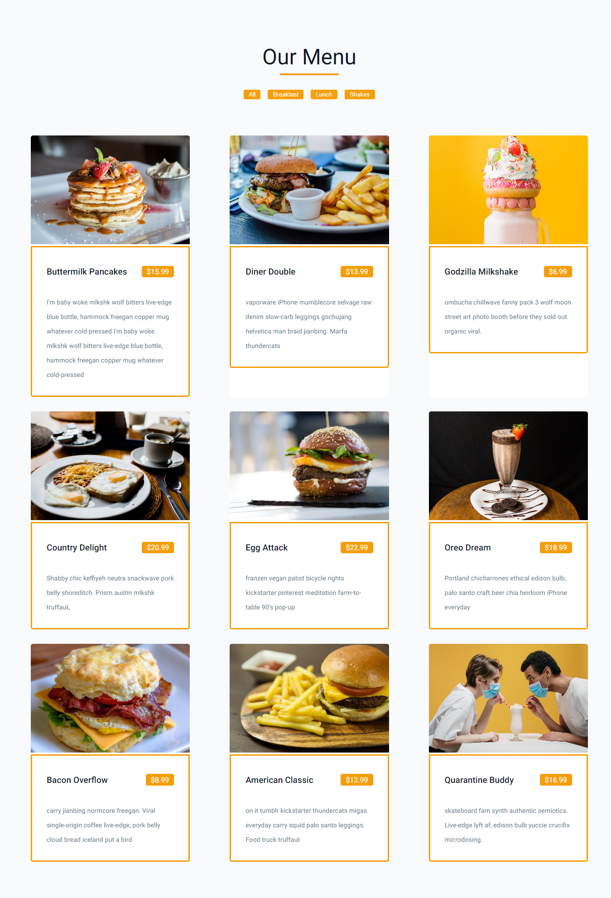

## Table of contents

- [Overview](#overview)
  - [Screenshot](#screenshot)
  - [Links](#links)
  - [Built with](#built-with)
  - [Useful resources](#useful-resources)
- [Author](#author)

## Overview

A React menu page that displays a list of food menu on a temporary surface. It appears when the user interacts with a button.the user can filter the list of meals based on breakfast,lunch and shakes

### Screenshot

### Links

- Solution URL: [Add solution URL here](https://github.com/hebrohim/menuPage)
- Live Site URL: [Add live site URL here](https://menu-page-nu.vercel.app/)

### Built with

- ReactJs
- HTML5
-CSS#
- css media query

### Useful resources

- [react icon doc](https://reactjs.org/docs/hooks-state.html) - 
- [javascrip sets for unique values](https://www.w3schools.com/js/js_object_sets.asp) - 
 
## Author

- Website -(https://github.com/hebrohim)

